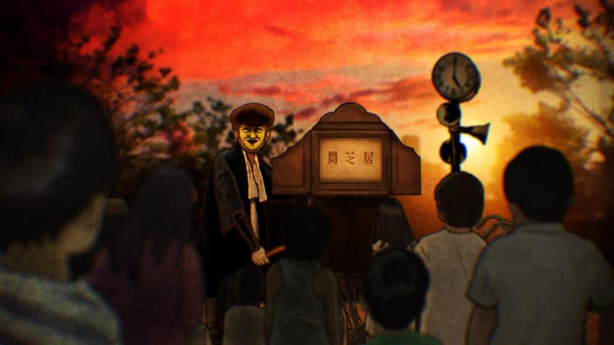

# *Kaidan Nihonbunka: A Journey Through Hyakumonogatari's Ghostly Tales*

> Welcome to the Kaidan Nihonbunka Dataset

<div align="center">
    <picture>
        <source 
        srcset="assets/image.jpg"
        media="(prefers-color-scheme: dark)"
        />
        <source
        srcset="assets/image.jpg"
        media="(prefers-color-scheme: light), (prefers-color-scheme: no-preference)"
        />
        
    </picture>
</div>


## About Name
`kaidan Nihonbunka` translates to `怪談日本文化` in Japanese:
- `怪談 (Kwaidan)`: Ghost story or supernatural tale.
- `日本文化 (Nihonbunka)`: Japanese culture.

So, the translated name would be `怪談日本文化`.


## Overview

The `kaidan Nihonbunka` Dataset is a collection of Japanese folklore of ghost stories, also known as "kaidan", associated with the traditional Japanese ritual of Hyakumonogatari. This dataset contains approximately 8000 rows of ghost stories, including their old names, new names generated by GPT-4, the text content of the stories, and URLs for additional information or sources.

You find code of this dataset in my Huggingface account <a href="https://huggingface.co/datasets/v3xlrm1nOwo1/KaidanNihonbunka">v3xlrm1nOwo1</a>.

## Data Format

### The dataset is provided in two formats `Parquet` and `Pickle`:
These formats and fields provide flexibility for different use cases, allowing researchers and data scientists to work with the dataset using their preferred tools and programming languages.

1. **Parquet File**: Contains structured data in a columnar format, suitable for data analysis and processing with tools like Apache Spark.
2. **Pickle File**: Contains a serialized Python object, allowing for easy loading and manipulation of the dataset in Python environments.


### Dataset Fields
Each entry in the dataset is represented by a row with the following fields:


   | Field    | Description                                                                                                 |
   |----------|-------------------------------------------------------------------------------------------------------------|
   | `Old Name` | The old name or previous designation of the ghost story.                                                    |
   | `New Name` | Generated by GPT-4, this column contains the new name or a modernized version of the ghost story's title.  |
   | `Kaidan`   | The text or content of the ghost story.                                                                    |
   | `URL`      | Contains URLs related to the ghost story, such as links to additional information or sources.               |


## Usage

Researchers, data scientists, and enthusiasts interested in Japanese folklore, ghost stories, or cultural rituals like Hyakumonogatari can utilize this dataset for various purposes, including:

- Analyzing themes and patterns in ghost stories.
- Building machine learning models for story generation or classification.
- Exploring connections between traditional rituals and storytelling.


```py
import datasets

# Load the dataset
dataset = datasets.load_dataset('v3xlrm1nOwo1/KaidanNihonbunka')

print(dataset)
```

```py
DatasetDict({
    train: Dataset({
        features: ['old name', 'new name', 'kaidan', 'url'],
        num_rows: 8559
      })
  })
```


## Acknowledgments

We would like to acknowledge the creators of the original ghost stories and the individuals or sources that contributed to compiling this dataset. Without their efforts, this collection would not be possible.


## License

This dataset is distributed under the [Apache License 2.0](https://www.apache.org/licenses/LICENSE-2.0), allowing for flexible usage and modification while ensuring proper attribution and adherence to copyright laws.


> **_NOTE:_**  To contribute to the project, please contribute directly. I am happy to do so, and if you have any comments, advice, job opportunities, or want me to contribute to a project, please contact me I am happy to do so <a href='mailto:v3xlrm1nOwo1@gmail.com' target='blank'>v3xlrm1nOwo1@gmail.com</a>